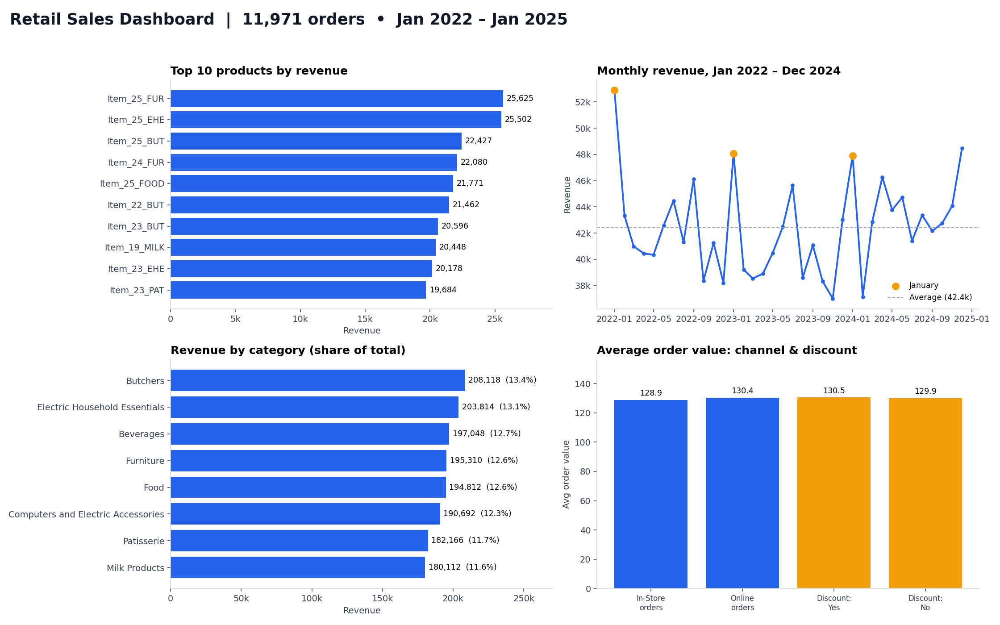
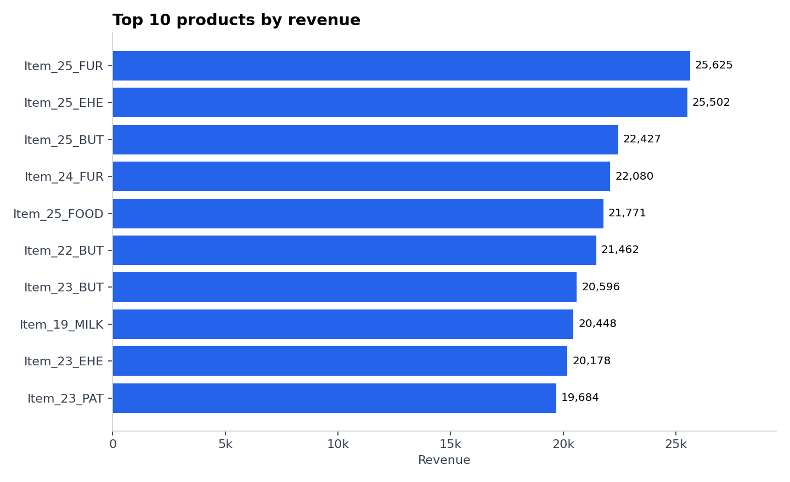
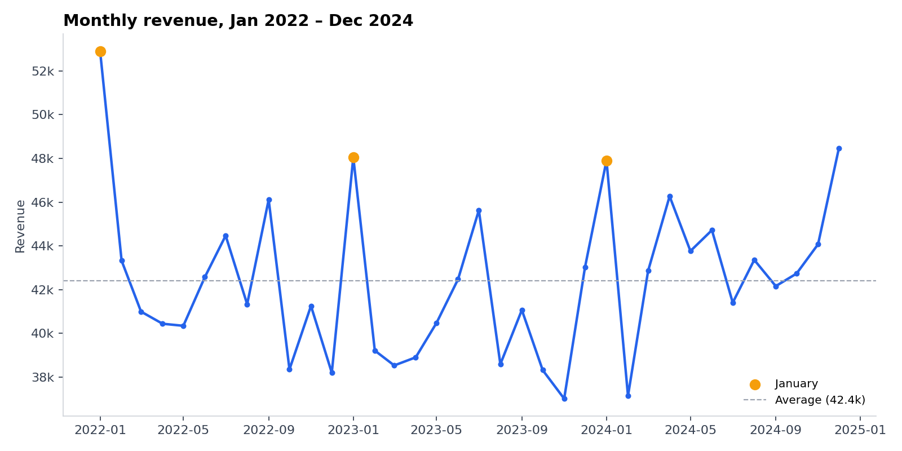
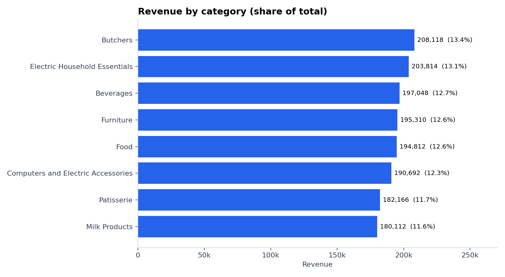
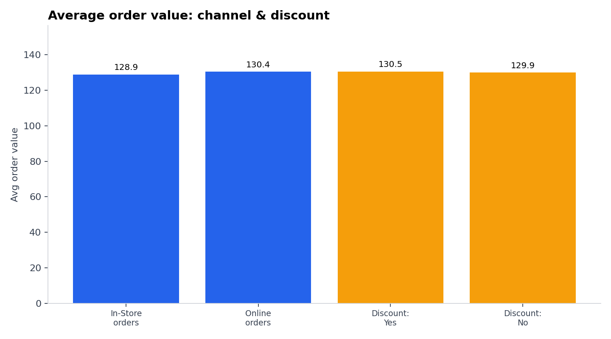

# Retail Sales Analysis: Data Cleaning, SQL & Visualization

**Turning a messy 12,575-row sales export into a clean database, 9 SQL reports, and actionable business insights, using Python, SQLite and SQL.**



---

## 📌 Project Overview

A retail store's raw sales export was unusable for reporting: **~40% of rows had at least one missing value** (about 10% even when ignoring the optional discount flag) across five columns, and revenue figures couldn't be trusted. This project takes that file end to end:

1. **Cleans** the data with pandas, recovering missing values instead of blindly deleting rows
2. **Loads** it into a SQLite database with an enforced schema
3. **Analyzes** it with 9 SQL queries (including window functions and CTEs)
4. **Visualizes** the results with matplotlib
5. **Delivers** business insights and recommendations

**Business questions answered:** Which products and categories drive revenue? How do sales trend over time? Who are the best customers? Do discounts increase spending? Which products should be reviewed?

## 📊 Key Numbers

| Metric | Value |
|---|---|
| Orders analyzed | **11,971** |
| Total revenue | **1,552,071** |
| Average order value | **129.65** |
| Customers / Products / Categories | 25 / 200 / 8 |
| Period covered | Jan 1, 2022 – Jan 18, 2025 |
| Data retained after cleaning | **95.2%** |

## 🛠️ Tools & Skills Demonstrated

- **Python** (pandas, matplotlib, sqlite3, pathlib)
- **SQL** (SQLite): `GROUP BY`, CTEs, window functions (`SUM() OVER`, `LAG()`), `UNION ALL`
- **Data cleaning:** missing-value recovery, type fixing, deduplication, validation checks
- **Database design:** primary keys, `NOT NULL` / `CHECK` constraints, indexes
- **Data visualization** and business storytelling

## 📁 Project Structure

```
retail-sales-analysis/
├── data/
│   ├── raw/retail_store_sales.csv        # original messy data
│   └── processed/
│       ├── cleaned_data.csv              # output of step 1
│       └── retail_sales.db               # SQLite database (step 2)
├── src/
│   ├── 01_clean_data.py                  # cleaning pipeline
│   ├── 02_load_to_sqlite.py              # database creation
│   └── 03_run_analysis.py                # runs SQL + builds charts
├── sql/queries.sql                       # all 9 analysis queries
├── results/                              # one CSV per query
├── charts/                               # PNG visualizations
├── requirements.txt
└── README.md
```

---

## 🧹 Step 1: Data Cleaning (pandas)

### Problems found in the raw data

| Column | Missing values | % of rows |
|---|---|---|
| Item | 1,213 | 9.6% |
| Price Per Unit | 609 | 4.8% |
| Quantity | 604 | 4.8% |
| Total Spent | 604 | 4.8% |
| Discount Applied | 4,199 | 33.4% |

### My approach: recover, don't just delete

Dropping every incomplete row would have thrown away about 40% of the data. Instead I checked how the data is structured and used those relationships to rebuild missing values:

- **Every item has exactly one fixed price**, and **within a category each price maps to exactly one item** (verified: zero collisions).
- **`Total Spent = Price Per Unit × Quantity`** holds in 100% of complete rows.

| Issue | Fix | Result |
|---|---|---|
| 609 rows missing both price and item | Rebuilt price from `Total ÷ Quantity`, then looked up the item from `(category, price)` | **609 prices and 609 items recovered** |
| 604 rows missing **both quantity and total** (price was known) | Revenue can't be reconstructed without either one, so rows were removed | 604 rows dropped (4.8%) |
| 4,199 missing `Discount Applied` | Labeled **"Unknown"** instead of guessing Yes/No | No invented data |
| Inconsistent names/types | Standardized column names, trimmed text, parsed dates, integer quantities | Clean schema |

### Validation checks (the script fails if any of these break)

- ✅ Transaction IDs are unique
- ✅ All prices and quantities are positive
- ✅ `price × quantity = total` for every row
- ✅ No missing dates
- ✅ **0 missing values** in the final dataset

---

## 🗄️ Step 2: Database Design (SQLite)

The cleaned data was loaded into a `sales` table with an explicit schema rather than letting pandas guess types:

```sql
CREATE TABLE sales (
    transaction_id   TEXT PRIMARY KEY,
    customer_id      TEXT    NOT NULL,
    category         TEXT    NOT NULL,
    item             TEXT    NOT NULL,
    price_per_unit   REAL    NOT NULL CHECK (price_per_unit > 0),
    quantity         INTEGER NOT NULL CHECK (quantity > 0),
    total_spent      REAL    NOT NULL CHECK (total_spent > 0),
    payment_method   TEXT    NOT NULL,
    location         TEXT    NOT NULL,
    transaction_date TEXT    NOT NULL,
    discount_applied TEXT    NOT NULL CHECK (discount_applied IN ('Yes','No','Unknown')),
    year INTEGER NOT NULL, month INTEGER NOT NULL, year_month TEXT NOT NULL
);
```

Indexes were added on date, category, item and customer, and the load was verified (row count and total revenue match the source CSV exactly).

---

## 🔍 Step 3: SQL Analysis

All queries live in [`sql/queries.sql`](sql/queries.sql); each result is saved to [`results/`](results).

| # | Business question | Techniques |
|---|---|---|
| 1 | Top 10 products by revenue | `GROUP BY`, `ORDER BY`, `LIMIT` |
| 2 | Monthly sales trend | Aggregation by `year_month` |
| 3 | Revenue & share by category | **Window function** `SUM() OVER ()` |
| 4 | Top 5 customers | Multi-metric aggregation |
| 5 | Average order value (overall & by channel) | `UNION ALL` |
| 6 | Bottom 10 products | Sorting / ranking |
| 7 | Year-over-year growth | **CTE + `LAG()`** window function |
| 8 | Impact of discounts on spending | Segmentation |
| 9 | Payment method mix | Window-function percentages |

**Example: revenue share by category (window function):**

```sql
SELECT
    category,
    ROUND(SUM(total_spent), 2) AS revenue,
    ROUND(100.0 * SUM(total_spent) / SUM(SUM(total_spent)) OVER (), 2) AS revenue_share_pct
FROM sales
GROUP BY category
ORDER BY revenue DESC;
```

---

## 📈 Step 4: Visualizations

| | |
|---|---|
|  |  |
|  |  |

---

## 💡 Business Insights & Recommendations

**1. Premium-priced products win on revenue without losing orders.**
The top 10 products have an average unit price of **38.6 vs 23.0** for the full catalog, and the top three (`Item_25_FUR`, `Item_25_EHE`, `Item_25_BUT`) are each the highest-priced item (41.0) in their category. Across products, price correlates strongly with revenue (r = 0.65) but almost not at all with number of orders (r = 0.06), so customers don't buy premium items less often.
→ *Recommendation: prioritize stock and promotion of top-tier items in each category.*

**2. January is the strongest month, every year.**
January averages ~49.6k in revenue vs ~41.7k for the other months (+19%). It was the top month in 2022 and 2023, and second only to December in 2024. Jan 2022 is the all-time peak at 52.9k. December is also slightly above average. Monthly revenue is otherwise fairly flat.
→ *Recommendation: plan inventory and staffing ahead of the December–January peak.*

**3. Revenue is healthy and well-diversified.**
Yearly revenue went from 510k (2022) to 491k (**-3.7%** in 2023) to 525k (**+6.8%** in 2024), a recovery to a new high. The 8 categories each hold 11.6%–13.4% of revenue, so there is no dependence on a single category. The top 5 of 25 customers account for 21.5% of revenue (an even split would be 20%), so there's no customer concentration risk either.

**4. Discounts show no measurable lift in order size.**
Average order value is **130.49 with a discount vs 129.95 without** (+0.4%), and quantity per order is the same. Online and in-store orders are also nearly identical (130.42 vs 128.86), with online generating 51% of revenue.
→ *Recommendation: run a controlled test before spending more on discounts; the current data doesn't show they raise basket size.*

**5. A small tail of products barely sells.**
The 10 lowest-revenue products have an average of just **13 orders vs 60** for the typical product and together contribute **only 0.45%** of revenue (e.g. `Item_3_EHE`: 5 orders, 224 revenue).
→ *Recommendation: review these for delisting, repricing or promotion.*

---

## ⚠️ Assumptions & Limitations

- **Currency isn't specified in the dataset**, so values are shown as plain numbers.
- **2025 contains only 18 days** (data ends Jan 18, 2025), so it is excluded from year-over-year growth and from the monthly trend chart.
- **33% of orders have an "Unknown" discount status.** The discount analysis compares the Yes/No groups and treats Unknown separately; the finding should be re-checked with complete data.
- **604 rows (4.8%)** were removed because revenue couldn't be reconstructed.
- Metrics are remarkably evenly distributed across categories, customers and channels, so conclusions describe patterns in *this* dataset and should be validated before being generalized.

---

## 🚀 How to Run

```bash
git clone <https://github.com/ArnavTinkalKr/retail-sales-analysis.git>
cd retail-sales-analysis
pip install -r requirements.txt

python src/01_clean_data.py      # clean the raw data
python src/02_load_to_sqlite.py  # build the SQLite database
python src/03_run_analysis.py    # run SQL queries + generate charts
```

To explore the database yourself, open `data/processed/retail_sales.db` with [DB Browser for SQLite](https://sqlitebrowser.org/) or run any query from `sql/queries.sql`.

---

## 📬 About Me / Work With Me

I'm **TINKAL KUMAR**, a data freelancer specializing in **data cleaning, SQL reporting and analysis with Python**. If you have messy spreadsheets or databases that need to become reliable reports, I can help.

- 📧 Email: **tinkal7549@gmail.com**
- 💼 Upwork: **https://www.upwork.com/freelancers/~01f5fa966e964a7e94**
- 🔗 LinkedIn: **https://www.linkedin.com/in/tinkal**

*Dataset: "Retail Store Sales" (Kaggle). Used here for educational and portfolio purposes.*
